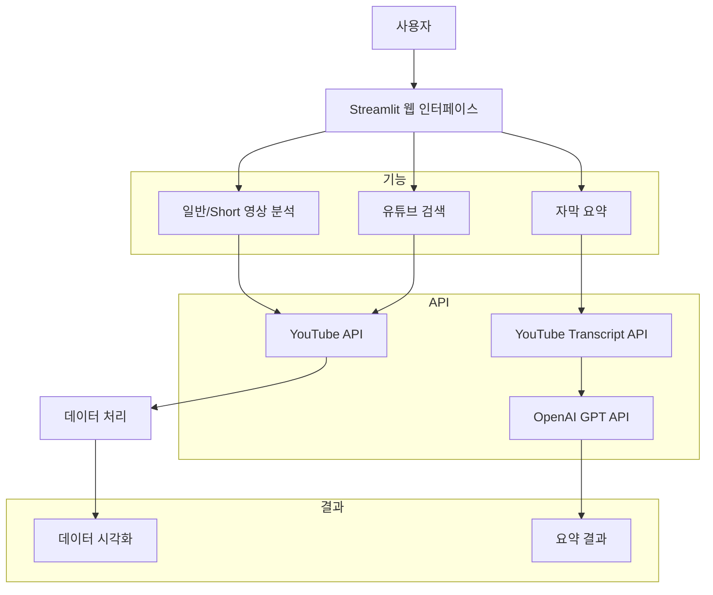

# YouTube Summarizer

YouTube 동영상을 분석하고 자막을 요약하는 Streamlit 웹 애플리케이션입니다.

## 주요 기능

- 일반 동영상 및 쇼츠 동영상 분석
- 카테고리별 동영상 분포 시각화
- YouTube 동영상 검색
- 자막 추출 및 GPT를 이용한 요약

## 설치 방법

1. 저장소 클론
```bash
git clone https://github.com/[your-username]/YoutubeSummarizar.git
cd YoutubeSummarizar
```

2. Python 가상환경 설정
```bash
python -m venv venv
source venv/bin/activate  # Windows: venv\Scripts\activate
```

3. 필요한 패키지 설치
```bash
pip install -r requirements.txt
```

4. 환경 변수 설정
`.env` 파일을 생성하고 다음 내용을 추가:
```
openai.api_key=your_openai_api_key
```

5. YouTube API 설정
- [Google Cloud Console](https://console.cloud.google.com/)에서 프로젝트 생성
- YouTube Data API v3 활성화
- OAuth 2.0 클라이언트 ID 생성
- `client_secret.json` 파일을 프로젝트 루트 디렉토리에 저장

## 실행 방법

```bash
streamlit run app.py
```

## 주의사항

- `.env`, `client_secret.json`, `token.json` 파일은 절대 GitHub에 올리지 마세요.
- `node_modules` 디렉토리는 자동으로 생성되므로 GitHub에 올릴 필요가 없습니다.

## 사용된 기술

- Python
- Streamlit
- YouTube Data API v3
- OpenAI GPT
- Pandas
- Plotly

## 라이선스

MIT License

## 아키텍처 구조



### 주요 컴포넌트 설명

1. **기능**
   - 일반/Short 영상 분석
     - YouTube API를 통한 좋아요한 동영상 목록 수집
     - 동영상 메타데이터 분석
   - 유튜브 검색
     - 검색어 기반 동영상 검색
     - 검색 결과 메타데이터 수집
   - 자막 요약
     - URL 입력을 통한 자막 수집
     - GPT를 이용한 자막 요약

2. **API 통합**
   - YouTube Data API v3
     - 동영상 메타데이터 수집
     - 검색 기능
   - YouTube Transcript API
     - 자막 데이터 수집
   - OpenAI GPT API
     - 자막 요약 생성

3. **데이터 처리 및 결과**
   - 데이터 처리
     - Pandas를 통한 데이터 정제
     - 카테고리 매핑
   - 데이터 시각화
     - Plotly를 통한 그래프 생성
     - 카테고리별 분포도
   - 요약 결과
     - GPT를 통한 자막 요약
     - 요약된 내용 표시

4. **데이터 흐름**
   - 일반/Short 영상: 사용자 → YouTube API → 데이터 처리 → 시각화
   - 유튜브 검색: 검색어 → YouTube API → 데이터 처리 → 결과 표시
   - 자막 요약: URL → Transcript API → GPT API → 요약 결과 